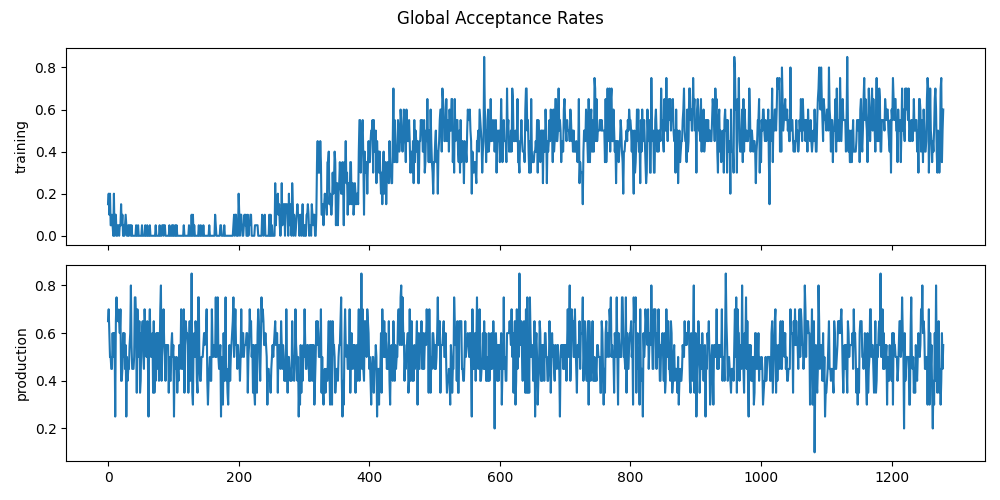

# Diagnostic on GWKokab Inference 

- We are using [flowMC](https://github.com/kazewong/flowMC) sampler for our analysis. You can read the more details in their examples and documentation to learn about tunning flowMC to make the good inference. In addition, you can also look into this [issue](https://github.com/kazewong/flowMC/issues/177) where we had fruitful discussion with flowMC developer.
- We are sharing our observation below which will help you to validate your runs and save some time.
- We assume that you have already learned that how to generate synthetic data using [gwk_genie]((https://github.com/gwkokab/gwkokab/blob/main/examples/gwk_genie.ipynb)) and also made the inference using [gwk_inference]((https://github.com/gwkokab/gwkokab/blob/main/examples/gwk_inference.ipynb)).

- The following are plots which we generated using GWKokab for the ecc-matters model with true parameters as $log_{10} (\mathcal{R}) = 2.0$, $\alpha = -1$, $m_{min}=10$, $m_{max}=50$, and $\sigma_{ϵ} = 0.05$.

# Injections and Posteriors

<div style="display: flex; justify-content: space-around;">
    <div style="margin: 10px;">
        
    </div>
    <div style="margin: 10px;">
        
    </div>
</div>


- Now, we can make the inference using the generated or any other data set.

- The first analysis uses the following values of the hyperparameter.

```
N_CHAINS = 20
LOCAL_MALA_SAMPLER_KWARGS = {
    "sampler": "MALA",
    "step_size": 1e-2,
    "jit": True,
}

NF_MODEL_KWARGS = {
    "key": KEY,
    "model": "MaskedCouplingRQSpline",
    "n_layers": 5,
    "hidden_size": [32, 32],
    "num_bins": 8,
    "n_features": N_DIM,
}

SAMPLER_KWARGS = {
    "n_dim": N_DIM,
    "rng_key": KEY,
    "data": None,
    "n_chains": N_CHAINS,
    "n_local_steps": 100,
    "n_global_steps": 65,
    "n_loop_training": 20,
    "n_loop_production": 20,
    "batch_size": 10000,
    "n_epochs": 5,
    "learning_rate": 0.001,
    "momentum": 0.9,
    "precompile": False,
    "verbose": False,
    "use_global": True,
    "logging": True,
    "outdir": "inf-plots",
}
```
# Inference Plots

- Everything is recovered well in the following plots, but local acceptance rate seems little low, it should be between $(0.2-0.8)$, so one can increase local steps from $100$ to $150$ to get the better acceptance rate which may give you little improved results but require more computational cost. 

<div style="display: flex; justify-content: space-around;">
    <div style="margin: 10px;">
        
    </div>
    <div style="margin: 10px;">
        
    </div>
</div>

<div style="display: flex; justify-content: space-around;">
    <div style="margin: 10px;">
        
    </div>
    <div style="margin: 10px;">
        
    </div>
</div>

The increment of local steps does improve the recovery of our model but not significantly considering the required computational cost. You can see the minor difference in corner plots and chain plots are almost similar.


<div style="display: flex; justify-content: space-around;">
    <div style="margin: 10px;">
        
    </div>
    <div style="margin: 10px;">
        
    </div>
</div>

<div style="display: flex; justify-content: space-around;">
    <div style="margin: 10px;">
        
    </div>
    <div style="margin: 10px;">
        
    </div>
</div>


For further improvement in local acceptance rate, you may reduce the step size. In the following plots, we decreased the local step size from $0.01$ to $0.008$.

<div style="display: flex; justify-content: space-around;">
    <div style="margin: 10px;">
        
    </div>
    <div style="margin: 10px;">
        
    </div>
</div>

<div style="display: flex; justify-content: space-around;">
    <div style="margin: 10px;">
        
    </div>
    <div style="margin: 10px;">
        
    </div>
</div>


- Now, lets's check by decreasing the step size further to 0.006. It will give us more reliable plots and each parameter recovered really well with the following setting.

```
N_CHAINS = 20

LOCAL_MALA_SAMPLER_KWARGS = {
    "sampler": "MALA",
    "step_size": 0.006,
    "jit": True,
}

NF_MODEL_KWARGS = {
    "key": KEY,
    "model": "MaskedCouplingRQSpline",
    "n_layers": 5,
    "hidden_size": [32, 32],
    "num_bins": 8,
    "n_features": N_DIM,
}

SAMPLER_KWARGS = {
    "n_dim": N_DIM,
    "rng_key": KEY,
    "data": None,
    "n_chains": N_CHAINS,
    "n_local_steps": 150,
    "n_global_steps": 65,
    "n_loop_training": 20,
    "n_loop_production": 20,
    "batch_size": 10000,
    "n_epochs": 5,
    "learning_rate": 0.001,
    "momentum": 0.9,
    "precompile": False,
    "verbose": False,
    "use_global": True,
    "logging": True,
    "outdir": "inf-plots",
}

```
For the reduced step size for local sampler,we got the following plots.

<div style="display: flex; justify-content: space-around;">
    <div style="margin: 10px;">
        
    </div>
    <div style="margin: 10px;">
        
    </div>
</div>

<div style="display: flex; justify-content: space-around;">
    <div style="margin: 10px;">
        
    </div>
    <div style="margin: 10px;">
        
    </div>
</div>

Now, just trying to increase the number chains if it improves anything. otherwise, we got pretty decent plots by now. Increasing the chains does not change the results. We used 40 chains for the same setting and got the following plots which are again similar and not worth using that much computation cost. 


<div style="display: flex; justify-content: space-around;">
    <div style="margin: 10px;">
        
    </div>
    <div style="margin: 10px;">
        
    </div>
</div>

<div style="display: flex; justify-content: space-around;">
    <div style="margin: 10px;">
        
    </div>
    <div style="margin: 10px;">
        
    </div>
</div>

- The minimal training to show the difference. You are almost getting your priors back in the corner plots below.

<div style="display: flex; justify-content: space-around;">
    <div style="margin: 10px;">
        
    </div>
    <div style="margin: 10px;">
        
    </div>
</div>

<div style="display: flex; justify-content: space-around;">
    <div style="margin: 10px;">
        
    </div>
    <div style="margin: 10px;">
        
    </div>
</div>
 
# Conclusion
- Always start from numner of `N_CHAINS = 10`, `step_size: 0.01`, `n_local_steps: 50`, `n_global_steps: 20`, `n_traning_loops = n_production_loops = 10`, `batch_size = 10,000` and `n_epochs =5`. 
- After looking at preliminary plots, mainly all the chain plots, if they are converging then you may increase hyper parameters according to your requirement. The above mentioned parameter are the ones you may to need to change to get the better results.
- According to our observation local and global acceptance rate chain plots values between $(0.2-0.8)$ give you nice recovery of true parameters.